# 🌬️ Smart Atomizer Protocol

> **Intelligent scent diffusion control based on presence, motion, and schedule.**

This system manages a scent diffuser (atomizer) to ensure it only operates when truly needed, preventing resource waste and "nose blindness." It uses a stacked-condition logic to verify presence and motion before dispensing scent.

---

## 📉 Efficiency Impact

> **💡 Amazing Stat:**
> Before implementing this automation, a bottle of essential oil would run out in **two weeks**.
> Thanks to this precise management (activating only upon motion and presence), a single bottle now lasts **almost 3 months!**

---

## 🛠 System Logic

The automation operates on a "Stacked Conditions" model. The atomizer will trigger **only if all the following conditions are met simultaneously**:

### 1. ⏱️ Triggers (When to check?)
* **Cyclic:** Runs every **20 minutes** (at :00, :20, and :40 past the hour).
* **Manual:** Can be forced immediately via a specific Event named `force_atomizer_spray` (e.g., from a dashboard button).

### 2. 🛡️ Gatekeepers (Mandatory Conditions)
The automation aborts immediately if any of these are false:
1.  **Global Mode:** House mode is set to `Home` (not `Travel/Vacation`).
2.  **Presence:** At least one person is home (`zone.home > 0`).
3.  **Active Occupancy:** Actual motion/occupancy is detected in the main living area (Living Room **OR** Kitchen).
    * *Sensors:* `binary_sensor.fp1_1_presence` / `binary_sensor.kitchen_occ_occupancy`.

### 3. 📅 Schedule (Time Windows)
Operation is permitted only during these specific windows:
* **Weekdays (Sun-Thu):**
    * Morning: `06:35` - `07:05` (Morning routine).
    * Evening: `16:45` - `22:30` (After work/school).
* **Weekends (Fri-Sat):**
    * Continuous: `06:45` - `22:30`.

---

## 🔄 Workflow Diagram

```mermaid
graph TD
    Trigger[Trigger: Time /20 min <br> OR Manual Force] --> GlobalCheck{Mode = Home?}
    GlobalCheck -- Yes --> PresenceCheck{Anyone Home?}
    GlobalCheck -- No --> Stop[🛑 Do Nothing]
    PresenceCheck -- Yes --> MotionCheck{Motion in<br>Living Room OR Kitchen?}
    PresenceCheck -- No --> Stop
    MotionCheck -- Yes --> TimeCheck{Is it valid Time?}
```



## ⚙️ Entities Used
Type,Entity ID,Role
Switch,switch.tasmota_2,The smart plug/device controlling the atomizer.
Input Select,input_select.home_travel,Main house mode selector.
Zone,zone.home,Used to count people at home.
Sensor,binary_sensor.fp1_1_presence,MmWave sensor (Living room).
Sensor,binary_sensor.kitchen_occ_occupancy,PIR/Occupancy sensor (Kitchen).

## 🚀 Manual Override
To force a spray immediately (ignoring the 20-min timer but respecting conditions):
```text
action: event.fire
data:
  event_type: force_atomizer_spray
```
    MotionCheck -- No --> Stop
    TimeCheck -- Yes --> Action[🚀 Spray for 10s]
    TimeCheck -- No --> Stop
