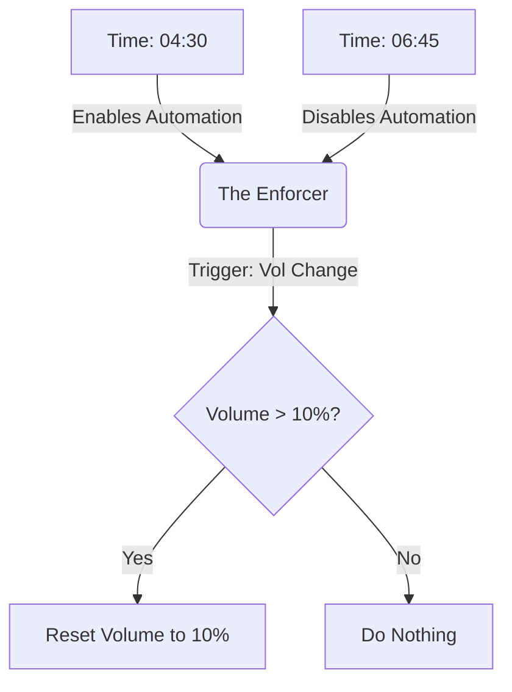

# 📺 Smart TV Silence Protocol

> **Automated volume control for early mornings to maintain a quiet home environment.**

This repository contains a dual-automation system for Home Assistant designed to enforce strict volume limits on the LG WebOS TV during sensitive morning hours. It ensures the house remains quiet even if the TV is turned on or the volume is accidentally increased.

---

## 🛠 System Architecture

The system is built on two decoupled automations working in tandem:

1.  **The Manager (`TV_silence_enabler`)**:
    * Acts as the scheduler.
    * Responsible for enabling/disabling the logic automation to save system resources outside of relevant hours.
2.  **The Enforcer (`tv_silence_10`)**:
    * Contains the actual business logic.
    * Monitors volume changes and proactively resets volume if limits are exceeded.

### 🔄 Logic Flow

### 📂 Automations Overview
1. The Manager (Scheduler)
State,Time,Action
ON,04:30:00,Enables the Enforcer automation.
OFF,06:45:01,Disables the Enforcer automation immediately.

State,Time,Action
ON,04:30:00,Enables the Enforcer automation.
OFF,06:45:01,Disables the Enforcer automation immediately.

2. The Enforcer (Logic)
Entity ID: automation.tv_silence_10

This is the core logic that runs only when enabled by the Manager. It features an optimized loop-prevention mechanism.

Triggers:

State change: Volume level adjusted.

State change: TV turned ON.

Time: 05:00:00 (Safety check).

Condition:

Volume is strictly above 10% (0.1).

Action:

Forces volume back to 10%.

### 🚀 Deployment & Usage
Prerequisites
Home Assistant Core

LG WebOS TV integration (configured as media_player.lg_webos_tv_oled65c1pva)

Installation
Copy the YAML code for the Enforcer into your automations.yaml.

Copy the YAML code for the Manager into your automations.yaml.

Reload Automations in 'Developer Tools'.

### ⚙️ Configuration Notes
Volume Threshold: Currently set to 0.1 (10%). To change, update the numeric_state condition and the volume_set action in the Enforcer automation.

Time Window:

The logic is technically active between 04:30 and 06:45.

Note: The Enforcer code itself may contain 05:00-07:00 conditions, but the Manager (Enabler) hard-cuts the power at 06:45, effectively ending the silence period then.
Filename: TV_silence_enabler.yaml

This automation handles the lifecycle of the silence protocol. It ensures the volume monitoring logic is only active when needed, preventing unnecessary background processing during the day.
