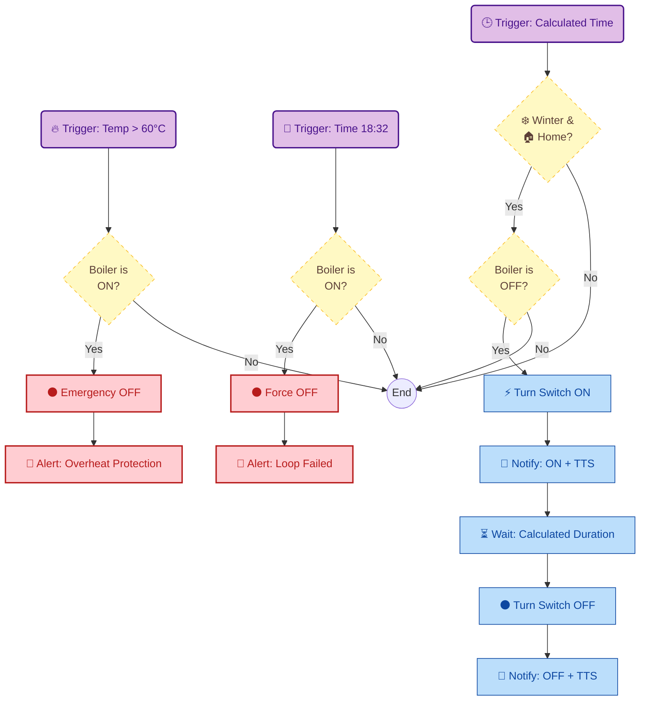

```mermaid
graph TD
    %% --- 1. הגדרת סגנונות עם טקסט כהה (High Contrast) ---
    %% Trigger - סגול רך עם טקסט סגול כהה
    classDef trigger fill:#E1BEE7,stroke:#4A148C,stroke-width:2px,color:#4A148C;
    
    %% Action - כחול רך עם טקסט כחול כהה
    classDef action fill:#BBDEFB,stroke:#0D47A1,stroke-width:1px,color:#0D47A1;
    
    %% Check - צהוב בהיר עם טקסט חום כהה (לקריאות מקסימלית)
    classDef check fill:#FFF9C4,stroke:#FBC02D,stroke-width:1px,stroke-dasharray: 5 5,color:#5D4037;
    
    %% Stop - אדום רך עם טקסט אדום כהה
    classDef stop fill:#FFCDD2,stroke:#B71C1C,stroke-width:2px,color:#B71C1C;

    %% --- 2. הגדרת הצמתים (Nodes) ---
    T_Time("🕒 Trigger: Calculated Time")
    T_Heat("🔥 Trigger: Temp > 60°C")
    T_Fail("🛑 Trigger: Time 18:32")

    %% --- 3. התהליך הראשי ---
    T_Time --> Cond_Global{"❄️ Winter &<br/>🏠 Home?"}
    Cond_Global -- Yes --> Cond_State{"Boiler is<br/>OFF?"}
    
    Cond_State -- Yes --> TurnOn["⚡ Turn Switch ON"]
    TurnOn --> NotifyON["📱 Notify: ON + TTS"]
    NotifyON --> Wait["⏳ Wait: Calculated Duration"]
    
    Wait --> TurnOff["⚫ Turn Switch OFF"]
    TurnOff --> NotifyOFF["📱 Notify: OFF + TTS"]

    %% --- 4. תהליך בטיחות (Safety) ---
    T_Heat --> Cond_On1{"Boiler is<br/>ON?"}
    Cond_On1 -- Yes --> SafetyOff["⚫ Emergency OFF"]
    SafetyOff --> NotifyHeat["📱 Alert: Overheat Protection"]

    %% --- 5. תהליך Failsafe ---
    T_Fail --> Cond_On2{"Boiler is<br/>ON?"}
    Cond_On2 -- Yes --> ForceOff["⚫ Force OFF"]
    ForceOff --> NotifyFail["📱 Alert: Loop Failed"]

    %% --- 6. סיומים ---
    Cond_Global -- No --> End((End))
    Cond_State -- No --> End
    Cond_On1 -- No --> End
    Cond_On2 -- No --> End

    %% --- 7. החלת העיצוב ---
    class T_Time,T_Heat,T_Fail trigger
    class TurnOn,NotifyON,Wait,TurnOff,NotifyOFF action
    class Cond_Global,Cond_State,Cond_On1,Cond_On2 check
    class SafetyOff,NotifyHeat,ForceOff,NotifyFail stop

```
