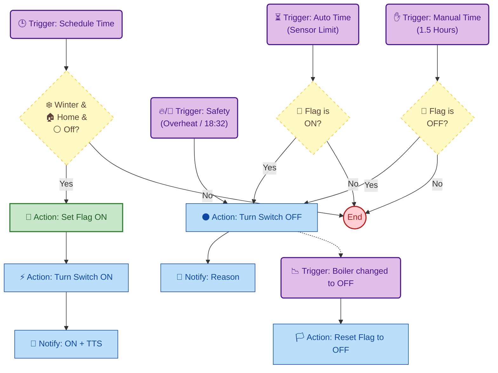

```mermaid
graph TD
    %% --- 1. הגדרת סגנונות (אותו עיצוב בדיוק) ---
    classDef trigger fill:#E1BEE7,stroke:#4A148C,stroke-width:2px,color:#4A148C;
    classDef action fill:#BBDEFB,stroke:#0D47A1,stroke-width:1px,color:#0D47A1;
    classDef check fill:#FFF9C4,stroke:#FBC02D,stroke-width:1px,stroke-dasharray: 5 5,color:#5D4037;
    classDef stop fill:#FFCDD2,stroke:#B71C1C,stroke-width:2px,color:#B71C1C;
    classDef flag fill:#C8E6C9,stroke:#2E7D32,stroke-width:2px,color:#1B5E20;

    %% --- 2. אוטומציה 1: הדלקה (ON Logic) ---
    T_Sched("🕒 Trigger: Schedule Time")
    Cond_Global{"❄️ Winter &<br/>🏠 Home &<br/>⚪ Off?"}
    Act_FlagON["🚩 Action: Set Flag ON"]
    Act_TurnON["⚡ Action: Turn Switch ON"]
    Act_NotifyON["📱 Notify: ON + TTS"]

    T_Sched --> Cond_Global
    Cond_Global -- Yes --> Act_FlagON
    Act_FlagON --> Act_TurnON
    Act_TurnON --> Act_NotifyON

    %% --- 3. אוטומציה 2: כיבוי (OFF Logic) ---
    %% טריגרים
    T_Auto("⏳ Trigger: Auto Time<br/>(Sensor Limit)")
    T_Manual("✋ Trigger: Manual Time<br/>(1.5 Hours)")
    T_Safety("🔥/🛑 Trigger: Safety<br/>(Overheat / 18:32)")

    %% בדיקות
    Cond_Flag{"🚩 Flag is<br/>ON?"}
    Cond_NoFlag{"🚩 Flag is<br/>OFF?"}

    %% פעולה מרכזית
    Act_TurnOFF["⚫ Action: Turn Switch OFF"]
    Act_NotifyOFF["📱 Notify: Reason"]

    %% זרימה אוטומטית
    T_Auto --> Cond_Flag
    Cond_Flag -- Yes --> Act_TurnOFF

    %% זרימה ידנית
    T_Manual --> Cond_NoFlag
    Cond_NoFlag -- Yes --> Act_TurnOFF

    %% זרימה בטיחותית (עוקף דגלים)
    T_Safety --> Act_TurnOFF

    Act_TurnOFF --> Act_NotifyOFF

    %% --- 4. אוטומציה 3: ניקיון (Cleanup) ---
    T_Clean("📉 Trigger: Boiler changed to OFF")
    Act_FlagOFF["🏳️ Action: Reset Flag to OFF"]

    %% חיבור לוגי (הכיבוי מפעיל את הניקיון)
    Act_TurnOFF -.-> T_Clean
    T_Clean --> Act_FlagOFF

    %% --- 5. סיומים ---
    Cond_Global -- No --> End((End))
    Cond_Flag -- No --> End
    Cond_NoFlag -- No --> End

    %% --- 6. החלת עיצוב ---
    class T_Sched,T_Auto,T_Manual,T_Safety,T_Clean trigger
    class Act_TurnON,Act_NotifyON,Act_TurnOFF,Act_NotifyOFF,Act_FlagOFF action
    class Cond_Global,Cond_Flag,Cond_NoFlag check
    class End stop
    class Act_FlagON flag
```
