# 🏠 Master Smart Home Presence Automation

This automation acts as the central brain for house state management. It handles "Leaving" and "Arriving" events with advanced logic to prevent false positives, ensuring the house is secured only when it's truly empty, and welcomes you back efficiently.

## 🌟 Key Features

* **Double-Check Verification:** Ensures the house doesn't turn off if someone is still inside (using multiple occupancy sensors).
* **"Freshness" Logic:**
    * Verifies that the main door/lock was actually used recently before arming.
    * **FP1 Logic:** Checks that the living room had motion in the last 20 minutes (verifying actual exit path) but is currently empty.
* **Time-Fencing:** "Leaving" logic only triggers during workdays (Sun-Thu) before 18:00 to avoid accidental shutdowns in the evening/weekends.
* **Smart Return:** Automatically turns on entrance lights if arriving after sunset (with offset).
* **Parallel Execution:** Turns off media devices and adjusts shutters simultaneously for faster response.
* **Automated Shutters:** Closes blinds to specific preset positions (ventilation mode or fully closed) upon departure.

## 🛠️ Logic Flow (Mermaid)

```mermaid
graph TD
    Start([🚀 Trigger: sensor.is_anyone_home]) --> |Change State| Decision{State Change?}

    %% --- LEAVING LOGIC ---
    Decision -- "To AWAY (From Pending)" --> TimeCheck{"🕒 Time < 18:00 <br/>& Weekday (Sun-Thu)?"}
    
    TimeCheck -- Yes --> DoorCheck{"🚪 Door/Lock used <br/>in last 10m?"}
    TimeCheck -- No --> End((❌ Stop))
    
    DoorCheck -- Yes --> OccCheck{"👀 All Room Sensors<br/>== OFF?"}
    DoorCheck -- No --> End
    
    OccCheck -- Yes --> FP1Check{"📡 FP1 Logic:<br/>Was active < 20m ago?"}
    OccCheck -- No --> End
    
    FP1Check -- Yes --> ActionLeave["🔒 ACTIONS:<br/>1. Set Input Text -> AWAY<br/>2. Send Telegram Alert<br/>3. Run 'Lights Off' Script<br/>4. Run 'ACs Off' Script<br/>5. Parallel Exec:<br/>- Turn Off TVs<br/>- Close Blinds (Custom %)"]

    %% --- ARRIVING LOGIC ---
    Decision -- "To HOME (From AWAY)" --> ActionArrive["🏠 ACTIONS:<br/>1. Set Input Text -> HOME<br/>2. Send Telegram Welcome"]
    
    ActionArrive --> SunCheck{"☀️ Sunset -30m?"}
    
    SunCheck -- Yes --> LightOn[💡 Turn On Entrance Light]
    SunCheck -- No --> Done((✅ Done))
    LightOn --> Done
    ActionLeave --> Done

    style Start fill:#f9f,stroke:#333,stroke-width:2px
    style ActionLeave fill:#ffcccc,stroke:#f00,stroke-width:2px
    style ActionArrive fill:#ccffcc,stroke:#0f0,stroke-width:2px
    style LightOn fill:#ffffcc,stroke:#e6e600,stroke-width:2px
```

## 📋 Action Summary
| Category | 🏃‍♂️ Leaving (Away) | 🏠 Arriving (Home) |
| :--- | :--- | :--- |
| **💡 Lights** | **Global Off:** Triggers virtual button/script to kill all lights. | **Welcome Light:** Turns on entrance light (Only if dark). |
| **❄️ HVAC** | **Global Off:** Triggers script to turn off all AC units. | *(No Action)* |
| **🪟 Covers** | **Smart Close:** Sets specific positions (0% or 20%) for all blinds in parallel. | *(No Action)* |
| **📺 Media** | **Power Off:** Turns off all LG WebOS TVs in parallel. | *(No Action)* |
| **🔔 Alerts** | Telegram: "No one is home" + closing status. | Telegram: "Someone entered home". |

## 📋 Requirements
To use this automation, ensure you have the following entities configured:

Sensors
sensor.is_anyone_home (Main presence detection sensor)

binary_sensor.main_door_contact & binary_sensor.main_lock_contact

Occupancy Sensors: Kitchen, Shoes Room, Shower, Living Room (FP1 + Generic Zigbee).

Helpers & Scripts
input_text.anyone_home (Stores the final state)

automation.virtual_button_lights_off (Script/Automation to kill lights)

automation.closing_all_acs (Script/Automation to kill HVAC)

Cover Entities: Various smart blinds/shutters.

## ⚙️ Configuration
The automation uses a choose block to separate logic:

Leaving Path:

Strict conditions apply (Time, Door usage, Occupancy).

FP1 Buffer: The logic (now() - last_changed) < 1200 covers the delay between physically leaving the house and the system detecting the state change.

Parallel Actions: Media and Covers run simultaneously to reduce execution time.

Arriving Path:

Always executes notification and state update.

Conditionally toggles lights based on sun elevation.

## 📝 Notes
Privacy: This automation relies on local sensors.

Safety: The 20-minute buffer on the FP1 sensor prevents the system from arming if the living room has been stagnant for a long time (e.g., sleeping on the couch), assuming the exit path must involve movement.
